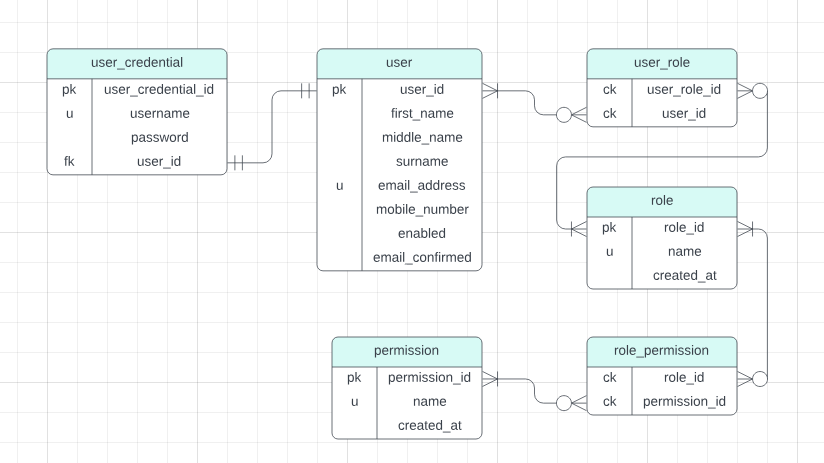

# Rust SQLx Application

## Overview

This Rust application demonstrates the usage of the SQLx library to interact with a PostgreSQL database. The application models a basic permission system with tables for permissions, roles, role_permissions (many-to-many relationship), and users (one-to-many relationship with roles). It was extracted from a project that am currently working on for a sms gateway saas.



## Prerequisites

- Rust
- PostgreSQL

## Setup

1. Clone the repository:

```bash
  git clone https://github.com/KevinWolf254/actix_web_sqlx_with_tests_example.git
```
2. Navigate to the project directory:

```bash
  cd actix_web_sqlx_tests
```

3. Install dependencies:

```bash
  cargo build
```

4. Set up the PostgreSQL database:

```bash
docker network create sms_gateway
```

```bash
docker run -d --name sms_gateway_db \
           -p 5432:5432 \
           --network sms_gateway \
           -e POSTGRES_PASSWORD=Pass12345 \
           -e POSTGRES_DB=SMS_GATEWAY \
           postgres:latest
```
5. Set up Admin4 to access postgresql (Optional)

```bash
docker run -p 5050:80 \
           --name sms_gateway_admin \
           --network sms_gateway \
           -e PGADMIN_DEFAULT_EMAIL=test@gmail.com \
           -e PGADMIN_DEFAULT_PASSWORD=Pass12345 \
           -d dpage/pgadmin4
```

6. Use the [README.md](https://github.com/KevinWolf254/actix_web_sqlx_with_tests_example/blob/main/migrations/README.md) file under migrations folder to create the database and its artifacts.

7. Run the project

```bash
  cargo run
```

## Contributing

Feel free to contribute to this project by opening issues or submitting pull requests. Any feedback or improvements are welcome!

## License

This project is licensed under the MIT License - see the LICENSE file for details.
[](https://choosealicense.com/licenses/mit/)